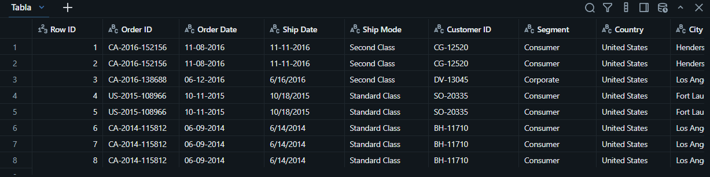
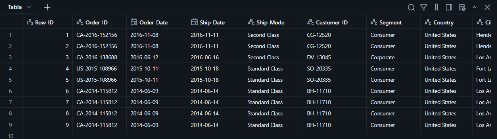
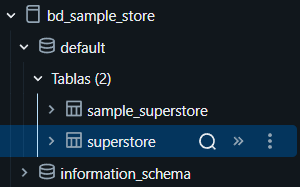

# Proyect_Sample_Superstore

## Resumen (Overview)
La gerencia comercial de **Superstore**, una cadena retail de artículos de oficina, muebles y tecnología en Estados Unidos, desea aumentar sus ventas y su rentabilidad. Sin embargo, no tiene claro qué productos, regiones y políticas de descuento están generando utilidad y cuáles la están destruyendo. Mi objetivo es utilizar **SQL** dentro de **Databricks** para analizar sus datos transaccionales de 2014 a 2017 y proporcionar recomendaciones basadas en datos al área comercial.
## 📩 Si quieres aprender SQL Conéctate conmigo

<p align="center">
  <a href="https://www.linkedin.com/in/gian-ruiz-lopez-644867197/?isSelfProfile=true">
    
 </a>

## Estructura del Proyecto

- [Sobre los Datos](#sobre-los-datos)
- [Tareas](#tareas)
- [Limpieza de Datos](#limpieza-de-datos)
- [Análisis Exploratorio de Datos e Insights](#análisis-exploratorio-de-datos-e-insights)


## Sobre los Datos

Los datos originales, junto con una explicación de cada columna, se pueden encontrar [aquí](https://www.kaggle.com/datasets/naveenkumar20bps1137/sample-superstore?select=Sample_+Superstore.csv).

El conjunto de datos contiene **una tabla con 9,994 registros y 19 columnas**



## Tareas (Task)

En este análisis, ayudo al departamento de RR.HH. a responder lo siguiente:

 1. **KPIs generales:**¿Cuáles son las ventas totales, la utilidad total, el margen, el número de pedidos y el número de clientes?
 2. **Categorías:** ¿Cuánto vende y cuánto gana cada categoría, qué margen tiene y qué porcentaje de las ventas totales representa?
 3. **Regiones:** ¿Qué región genera más ventas y cuál es la más rentable?
 4. **Productos estrella:** ¿Cuáles son los 10 productos con más ventas y cuánta utilidad dejan?
 5.  **Subcategorías con pérdidas:** ¿Qué subcategorías tienen utilidad negativa y cuál es su descuento promedio?
 6. **Impacto de los descuentos:** ¿Cómo cambia el margen según el rango de descuento aplicado? 
 7. **Logística:** ¿Cuál es el tiempo promedio de envío por modalidad de envío y qué porcentaje de pedidos tarda más de 5 días? 
 8. **Segmentos:** ¿Cuál es el ticket promedio por pedido en cada segmento de cliente?
 9. **Crecimiento anual:** ¿Cuál es el crecimiento de las ventas y la utilidad año contra año? 
 10. **Ventas acumuladas:** ¿Cómo evolucionan las ventas acumuladas mes a mes dentro de cada año?
 11. **Ranking regional:** ¿Cuáles son las 3 subcategorías más vendidas en cada región?
 12. **Pareto de clientes:** ¿Qué porcentaje de clientes genera el 80% de las ventas?


## Limpieza de Datos

Antes de realizar el análisis, es fundamental asegurar que los datos estén limpios y listos. Al revisar la tabla cargada en Databricks encontré dos problemas:

1. **Nombres de columnas con espacios y guiones** (`Order Date`, `Sub-Category`), que obligan a usar backticks en cada consulta 
2. **Fechas guardadas como texto y con dos formatos mezclados**: unas filas vienen como `11-08-2016` (MM-dd-yyyy) y otras como `6/16/2016` (M/d/yyyy).

#### Creación de la tabla limpia

Creé una tabla nueva **superstore** a partir de la tabla original **sample_superstore**, que se conserva intacta como respaldo. Estandaricé los nombres de columnas y convertí las fechas a tipo **DATE** para cada fecha se modifico el formato a **MM-dd-yyyy** si no aplica se intenta **M/d/yyyy**, y **COALESCE** conserva el que funcionó.

```sql
-- Mi primera consulta --
select *
from bd_sample_store.default.sample_superstore
--Se estandarizan los nombres de columnas (sin espacios ni guiones) y se crea una nueva tabla dennominada "superstore"

--Creacion de la tabla
create or replace table bd_sample_store.default.superstore as
select
`Row ID` as Row_ID,	
`Order ID` as Order_ID,
coalesce(try_to_date(`Order Date`,'MM-dd-yyyy'),
try_to_date(`Order Date`, 'M/d/yyyy')) as Order_Date,
coalesce(try_to_date(`Ship Date`,'MM-dd-yyyy'),
try_to_date(`Ship Date`, 'M/d/yyyy')) as Ship_Date,
`Ship Mode` as Ship_Mode,
`Customer ID` as Customer_ID,
Segment, 
Country,
City,
State, 
Region,
`Product ID` as Product_ID,
Category,
`Sub-Category` as Sub_Category,
`Product Name` as Product_Name,
Sales,
Quantity,
Discount,
Profit	

from bd_sample_store.default.sample_superstore
```


 


