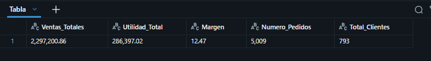
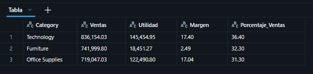
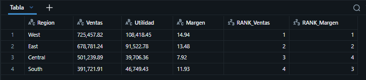
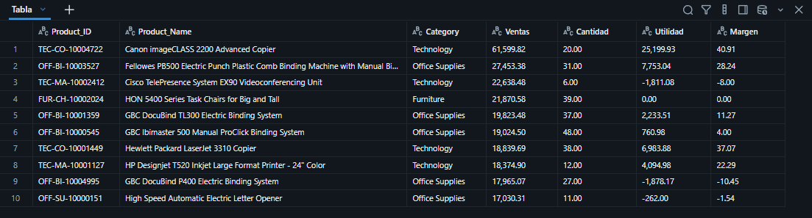
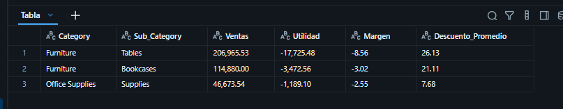
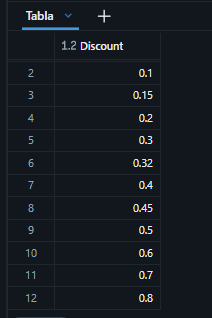
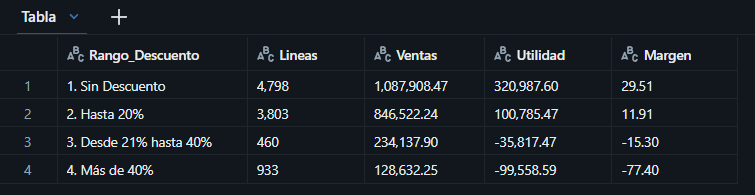
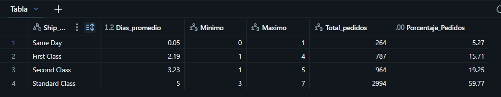
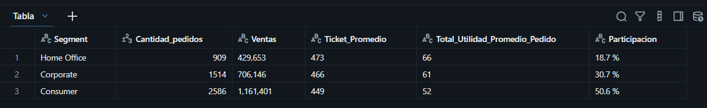

# Proyect_Sample_Superstore

## Resumen (Overview)
La gerencia comercial de **Superstore**, una cadena retail de artículos de oficina, muebles y tecnología en Estados Unidos, desea aumentar sus ventas y su rentabilidad. Sin embargo, no tiene claro qué productos, regiones y políticas de descuento están generando utilidad y cuáles la están destruyendo. Mi objetivo es utilizar **SQL** dentro de **Databricks** para analizar sus datos transaccionales de 2014 a 2017 y proporcionar recomendaciones basadas en datos al área comercial.
## 📩 Si quieres contactarme

<p align="center">
  <a href="https://www.linkedin.com/in/gian-ruiz-lopez-644867197/?isSelfProfile=true">
    
 </a>

## Estructura del Proyecto

- [Sobre los Datos](#sobre-los-datos)
- [Tareas](#tareas)
- [Limpieza de Datos](#limpieza-de-datos)
- [Análisis Exploratorio de Datos e Insights](#análisis-exploratorio-de-datos-e-insights)


## Sobre los Datos

Los datos originales, junto con una explicación de cada columna, se pueden encontrar [aquí](https://www.kaggle.com/datasets/naveenkumar20bps1137/sample-superstore?select=Sample_+Superstore.csv).

El conjunto de datos contiene **una tabla con 9,994 registros y 19 columnas**

```sql
 Mi primera consulta
select *
from bd_sample_store.default.sample_superstore
```


## Tareas (Task)

En este análisis,. a responder lo siguiente:

 1. **KPIs generales:**¿Cuáles son las ventas totales, la utilidad total, el margen, el número de pedidos y el número de clientes?
 2. **Categorías:** ¿Cuánto vende y cuánto gana cada categoría, qué margen tiene y qué porcentaje de las ventas totales representa?
 3. **Regiones:** ¿Qué región genera más ventas y cuál es la más rentable?
 4. **Productos estrella:** ¿Cuáles son los 10 productos con más ventas y cuánta utilidad dejan?
 5.  **Subcategorías con pérdidas:** ¿Qué subcategorías tienen utilidad negativa y cuál es su descuento promedio?
 6. **Impacto de los descuentos:** ¿Cómo cambia el margen según el rango de descuento aplicado? 
 7. **Logística:** ¿Cuál es el tiempo promedio de envío por modalidad de envío y qué porcentaje de pedidos tarda más de 5 días? 
 8. **Segmentos:** ¿Cuál es el ticket promedio por pedido en cada segmento de cliente?
 9. **Crecimiento anual:** ¿Cuál es el crecimiento de las ventas y la utilidad año contra año? 
 10. **Ventas acumuladas:** ¿Cómo evolucionan las ventas acumuladas mes a mes dentro de cada año?


## Limpieza de Datos

Antes de realizar el análisis, es fundamental asegurar que los datos estén limpios y listos. Al revisar la tabla cargada en Databricks encontré dos problemas:

1. **Nombres de columnas con espacios y guiones** (`Order Date`, `Sub-Category`), que obligan a usar backticks en cada consulta 
2. **Fechas guardadas como texto y con dos formatos mezclados**: unas filas vienen como `11-08-2016` (MM-dd-yyyy) y otras como `6/16/2016` (M/d/yyyy).

#### Creación de la tabla limpia

Creé una tabla nueva **superstore** a partir de la tabla original **sample_superstore**, que se conserva intacta como respaldo. Estandaricé los nombres de columnas y convertí las fechas a tipo **DATE** para cada fecha se modifico el formato a **MM-dd-yyyy** si no aplica se intenta **M/d/yyyy**, y **COALESCE** conserva el que funcionó.

```sql

--Se estandarizan los nombres de columnas (sin espacios ni guiones) y se crea una nueva tabla dennominada "superstore"

--Creacion de la tabla
create or replace table bd_sample_store.default.superstore as
select
`Row ID` as Row_ID,	
`Order ID` as Order_ID,
coalesce(try_to_date(`Order Date`,'MM-dd-yyyy'),
try_to_date(`Order Date`, 'M/d/yyyy')) as Order_Date,
coalesce(try_to_date(`Ship Date`,'MM-dd-yyyy'),
try_to_date(`Ship Date`, 'M/d/yyyy')) as Ship_Date,
`Ship Mode` as Ship_Mode,
`Customer ID` as Customer_ID,
Segment, 
Country,
City,
State, 
Region,
`Product ID` as Product_ID,
Category,
`Sub-Category` as Sub_Category,
`Product Name` as Product_Name,
Sales,
Quantity,
Discount,
Profit	

from bd_sample_store.default.sample_superstore
```


 


## Análisis Exploratorio de Datos (EDA) e Insights

### Pregunta #1 ¿Cuáles son las ventas totales, la utilidad total, el margen, el número de pedidos y el número de clientes?

Para hallar los principales KPIs, utilice funciones de agregacion como SUM,COUNT Y DISTINCT para saber cuanto vendio, cual fue su utilidad, cuantos clientes tuvo y cuantos pedidos tuvo. Además, use FORMAT_NUMBER para darle formato a los resultados.

```sql
select
format_number(sum(Sales),2) as Ventas_Totales,
format_number(sum(Profit),2) as Utilidad_Total,
format_number(sum(Profit)/sum(Sales)*100,2) as Margen,
format_number(count(distinct Order_ID),0) as Numero_Pedidos,
format_number(count(distinct Customer_ID),0) as Total_Clientes

from bd_sample_store.default.superstore ;
```



Entre el 2014 y 2017 Superstore, vendio USD 2.3 millones, tuvo una utilidad de USD 286 mil, con un margen de 12.47%. Atendio 5,009 pedidos de 793 clientes.

El Margen es positivo, pero hay que entender si por categoria o descuento quien puede afectar el margen.

### Pregunta #2  ¿Cuánto vende y cuánto gana cada categoría, qué margen tiene y qué porcentaje de las ventas totales representa?

Para encontrar la participacion por categoria, he agrupado por CATEGORY  y usé la   WINDOW  FUNCTION  SUM(SUM(Sales)) OVER y  el SUM para la suma de ventas de cada categoría y el SUM ... OVER () externo para sumar totales de todas las categorías, lo que permite obtener el porcentaje de participación en la misma consulta.


```sql

select 
    Category,
    format_number(sum(Sales),2) as Ventas,
    format_number(sum(Profit),2) as Utilidad,
    format_number(sum(Profit)/sum(Sales)*100,2) as Margen,
    format_number(sum(Sales)/sum(sum(Sales)) over()*100,2) as Porcentaje_Ventas

from bd_sample_store.default.superstore
group by Category

order by Ventas desc ;
```



Veo que la participacion de ventas de las 3 categorias estan casi a la par (36.40%, 32.30% y 31.30%), los margenes son buenos de 2 categorias como Technology 17.40% y Office Supplies 17.40%, pero la de Furniture es 2.49%. Esto significa que esta categoria necesita mayor analisis.

Forniture es es el principal problema de rentabilidad del negocio. Se recomienda revisar la estrategia de precios y descuentos para esta categoría para mejorar su rentabilidad.


### Pregunta #3  ¿Qué región genera más ventas y cuál es la más rentable?

 Esto lo solucions con Agrupar por REGION y aplicar dos WINDOW FUNCTIONS  RANK() OVER (ORDER BY ...), una ordena por ventas y la otra por margen. Así, en una sola tabla se ve si la región que más vende es también la más rentable.

```sql

SELECT
    Region,
    format_number(sum(Sales),2) as Ventas,
    format_number(sum(Profit),2) as Utilidad,
    format_number(sum(Profit)/sum(Sales)*100,2) as Margen,
    rank() over (order by sum(Sales) desc) as RANK_Ventas,
    rank() over (order by sum(Profit)/sum(Sales)*100 desc) as RANK_Margen


from bd_sample_store.default.superstore 
group by Region
order by Ventas desc ;
```



Los resultados muestran que West es la mas vende USD 725 mil y la que mejor margen tiene en 14.94%. La region Central es la tercera en el ranking de ventas, pero es la que peor margen tiene con 7.92%. La region South es la que menos vende, pero tiene mayor margen que la region Central con 11.93%. Se recomienda que Central y South puedan adoptar las politicas comercialees de la Region West y hay que revisar los descuentos que hace la Region Central que al parecer estan impactando en la utilidad. 

### Pregunta 4 ¿Cuáles son los 10 productos con más ventas y cuánta utilidad dejan?

Cómo lo resolví: Agrupé por Product_ID, Product_Name y Category, ordené por ventas de mayor a menor con ORDER BY  y DESC y limité a 10 resultados con LIMIT.

```sql
SELECT Product_ID, Product_Name, Category,
     format_number(sum(Sales),2) as Ventas,
     format_number(sum(Quantity),2) as Cantidad,
     format_number(sum(Profit),2) as Utilidad,
     format_number(sum(Profit)/sum(Sales)*100,2) as Margen

FROM bd_sample_store.default.superstore
group by Product_ID, Product_Name, Category
order by sum(sales) desc
limit 10 ;
```





De la lista, el producto mas vendido es Canon imageCLASS con USD 61.6 mil de ventas y un margen de 40.91%. Pero existen 3 productos que generan utilidad negativa, segun el ranking es el producto numero 3, 9 y 10. Se recomienda revisar la estrategia comercial de estos 3 productos.


### Pregunta 5 ¿Qué subcategorías tienen utilidad negativa y cuál es su descuento promedio?

Aqui busque agrupar por categoría y subcategoría y usé HAVING SUM(Profit) < 0, que filtra los grupos después de agregarlos (a diferencia de WHERE, que filtra filas antes). Además calculé el descuento promedio con AVG(Discount).

```sql

SELECT Category, Sub_Category,
     format_number(sum(Sales),2) as Ventas,
     format_number(sum(Profit),2) as Utilidad,
     format_number(sum(Profit)/sum(Sales)*100,2) as Margen,
     format_number(avg(Discount)*100,2) as Descuento_Promedio

FROM bd_sample_store.default.superstore
group by Category, Sub_Category
HAVING SUM(Profit) < 0
order by sum(Profit) ASC ;
```



La subcategoria Tables es la que tiene mayor uilidad negativa, pierde USD 17.7 mil y el descuento promedio es de 26.13% es el mas alto. Bookcases pierde USD 3.4 mil y el descuento promedio es de 21.11. La subcategoria que menos pierdes es Supplies.
 
 
Se recomienda limitar los descuentos en Tables y Bookcases, ademas hay que revisar a Supplies sus costos porque su descuento el promedio de descuento es inferior a las otras categorias.


### Pregunta 6 ¿Cómo cambia el margen según el rango de descuento aplicado? 

Primero necesito saber cuales son los valores unicos de descuento, para eso hice un SELECT DISTINCT y ORDER BY.

```sql
SELECT DISTINCT Discount
FROM bd_sample_store.default.superstore
ORDER BY Discount ASC ;
```

 Veo que el rango de descuentos va de (0 a 0.8)

 


Es necesaria la conversion  en rangos de negocio y ordenarlos de forma lógica.

En una CTE (WITH rangos AS) clasifiqué cada línea de venta en un rango con CASE WHEN. Le puse un número delante a cada rango ("1.", "2.", ...) para que el ORDER BY los muestre en orden lógico y no alfabético. Luego calculé el margen y un conteo de lineas para tener una referencia de los registros

```sql
WITH rangos AS (
    SELECT 
    CASE 
    WHEN Discount = 0 THEN '1. Sin Descuento'
    WHEN Discount <= 0.2 THEN '2. Hasta 20%'
    WHEN Discount <= 0.4 THEN '3. Desde 21% hasta 40%'
    ElSE                      '4. Más de 40%'
    END AS Rango_Descuento,
    Sales,
    Profit
FROM bd_sample_store.default.superstore
)

SELECT Rango_Descuento,
    format_number(count(*),0) AS Lineas,
    format_number(sum(Sales), 2) AS Ventas,
    format_number(sum(Profit), 2) AS Utilidad,
    format_number(sum(Profit) / sum(Sales) * 100, 2) AS Margen

FROM rangos
GROUP BY Rango_Descuento
ORDER BY Rango_Descuento;

```



Cuando no hay descuento en las ventas, el margen  es de 29.51%, cuando hay un descueto hasta del 20%, el margen es de 11.91%, pero cuando el descuento pasa de ese rango del 20%, el margen se vuelve negativo, en el rango 3, se vendio USD 234 mil pero el margen fue negativo.

Se recomienda que exista un tope de descuento del 20% para que la utilidad no sea negativa.


### Pregunta 7 ¿Cuál es el tiempo promedio de envío por modalidad de envío y qué porcentaje de pedidos tarda más de 5 días?

En una CTE con `SELECT DISTINCT` dejé un registro por pedido y calculé los días de envío con `DATEDIFF(Shi_Date, Order_Date)` (esto funciona gracias a que en la limpieza convertí las fechas a tipo `DATE`). Luego usé `AVG`, `MIN` y `MAX`

```sql
with pedidos as (
    select distinct
    Order_ID,
    Ship_Mode,
    DATEDIFF(Ship_Date, Order_Date) as Dias_de_envio
    from bd_sample_store.default.superstore
)

select Ship_Mode,
    round(avg(Dias_de_envio),2) as Dias_promedio,
    round(min(Dias_de_envio),2) as Minimo,
    round(max(Dias_de_envio),2) as Maximo,
    count(*) as Total_pedidos,
    round(count(*) * 100.0 / sum(count(*)) over(), 2) as Porcentaje_Pedidos
from pedidos
group by Ship_Mode
order by Dias_promedio asc ;
```



Veo que  Same Day se despacha en promedio el mismo día y First Class en 2.2 días. Standard Class concentra el 60% de los pedidos (2,994 de 5,009), tarda 5 días en promedio.

Se recomienda  reducir el tiempo de entrega en Standard Class, ya que tendría el mayor impacto en la experiencia del cliente. También se puede comunicar mejor la diferencia de tiempos para incentivar el uso de Second Class.

### Pregunta 8 ¿Cuál es el ticket promedio por pedido en cada segmento de cliente?

En una CTE sumé las ventas y la utilidad de cada pedido (`GROUP BY Order_ID, Segment`). Luego promedié esos totales por segmento con `AVG` y calculé la participación de cada segmento con la window function `SUM(SUM(...)) OVER ()`.

```sql
with pedido as (
    select 
    Order_ID,
    Customer_ID,
    Segment,
    sum(Sales) as Total_Ventas,
    sum(Profit) as Total_Utilidad
    from bd_sample_store.default.superstore
    group by Order_ID, Customer_ID, Segment
)

select Segment,
    count(*) as Cantidad_pedidos,
    format_number(sum(Total_Ventas),0) as Ventas,
    format_number(avg(Total_Ventas),0) as Ticket_Promedio,
    format_number(avg(Total_Utilidad),0) as Total_Utilidad_Promedio_Pedido,
    concat(format_number(sum(Total_Ventas)/sum(sum(Total_Ventas)) over()*100,1),' %') as Participacion
from pedido
group by Segment
order by Ticket_Promedio desc
```



El segmento Consumer representa casi el 51% del total de las ventas, pero tiene promedio mas bajo de ticket 449 y el promedio  mas bajo de utilidad por pedido en 52. Mientras que el segmento Home Office solo representa casi el 19% del total de las ventas, pero tiene el ticket  y la utilidad promedio mas alto de  los 3 segmentos.

Entonces, el segmento Home Office tiene margen de crecimiento, ya que tiene un promedio mas alto de ventas y utilidad por pedido. Vale la pena que la Gerencia pueda dirgir campañas especificas a este segmento.


